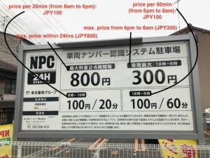
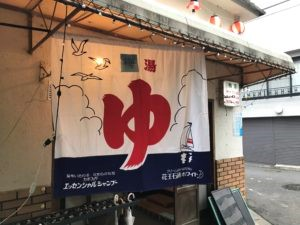

##Useful Links

Click [here](https://www.npa.go.jp/policies/application/license_renewal/pdf/english.pdf) to see an overview of Japanese rules and regulations.

All Japan Rent-a-car Association offers detailed information about renting and driving in Japan:  
[General information about car rental](http://www.rentacar.or.jp/en/)  
[Information about Driver‘s License](http://www.rentacar.or.jp/en/license/)  
[Information on how to obtain the Japanese translation (for licenses issued in Switzerland, Germany, France, Belgium, Slovenia, Monaco, Estonia and Taiwan)](http://www.jaf.or.jp/e/translation/switch.htm)  
[Guide for driving in Japan](http://www.rentacar.or.jp/en/guide/)  
[Traffic Rules](http://www.rentacar.or.jp/en/traffic/)  

##Driving in Japan

First of all, don’t worry about driving in Japan. Once you’ve gotten used to driving on the left side of the road it’s fairly easy to get around since all important signs are written in English as well as Japanese. The Japanese are very friendly and patient and you will rarely feel stressed by other drivers.
However, there are a few things to consider when planning a road trip through Japan.

- Drivers from certain countries need an official translation of their license issued by the Japan Automobile Federation (JAF). Click [here](http://www.japanbyvan.com/?page_id=207#license) for details

- Cars drive on the left side of the road and have the driver's seat and steering wheel on their right side. The legal minimum age for driving is 18 years. Road signs and rules follow international standards, and most signs on major roads are in Japanese and English.

- While drinking and driving is just a bad idea in any country, Japan takes a particularly strong stance against it. The law refers to a figure of 0.03 blood-alcohol content, but this country has a zero-tolerance policy towards drinking and driving. You can be sentenced to up to 3 years of jail time or have to pay up to 500,000 yen.  If you have passengers in the car, they too will be fined for being so irresponsible as to let you drink and drive.

- Most roads in Japan are toll free with the exception of expressways and some scenic driving routes. Road conditions are usually good, although side streets in the cities can be rather narrow or even impassable to larger vehicles.

- The typical speed limits are 80 to 100 km/h on expressways, 40 km/h in urban areas, 30 km/h in side streets and 50 to 60 km/h elsewhere.

- Although drivers generally tend to be well mannered and considerate, some common dangers on Japanese roads include drivers speeding over intersections even well after the traffic light has turned red.

- At railway crossings, cars must stop for a short moment even if the barrier is not lowered. Apart from that, make sure that the car in front of you has crossed the entire railway crossing before continuing on the crossing yourself.

Click [here](http://www.japanbyvan.com/?page_id=141) for more Information about driving in Japan.

##Park & Sleep
Surprisingly, it’s very easy to find a coin parking space in Japan, even in big cities like Tokyo or Osaka, however prices go up the closer you are to the city center.
Below an example of a coin parking 1km outside of Kyoto city

While wild camping in a tent is not common in Japan (and can be dangerous because of wild animals like bears and snakes in some areas), sleeping inside of your car is basically allowed everywhere you legally park your car (even in a coin parking lot).

###Roadside Station- Michi-no-Eki (道の駅)

Michi-no-Eki means „Roadside Station“ in Japanese. The Michi-no-Eki System was created to ensure a safe, comfortable road traffic environment and a unique space to show the individuality of a region. There are over 1100 Michi-no-Eki in Japan (Nov. 2017)
Each Michi-no-eki has three features:
„Refresh“ —> Rest facilities that include 24hr free parking and restrooms.
„Community“ —> Regional co-operation where cultural centers, tourist attractions and other local development facilities promote interaction with the region. In many places, local vegetables, fruits, rice and sweets are sold in a small shop with specific information about the region.
„Information“ —> Road, Tourist and emergency care information is available.
One thing we really like about Michi-no-Eki (beside the fact that we can sleep there for free) is that there are always at least 1 or 2 other campers, since Michi-no-Eki are popular throughout Japan. It’s absolutely common to cook dinner or your morning coffee there.
Even though Michi-no-Eki can not be compared to campsites, they are a very convenient option for your travels, especially if you’re just on your way from a city or place to your next destination.

###How to find a Michi-no-Eki
[Michi-no-Eki official homepage](https://www.michi-no-eki.jp/stations/english) —> Michi-no-Eki search and information about each station in English
We have 2 different Apps installed on the tablet in our van, one to find Michi-no-Eki only and another one with Road Stations, Highway Rest Stops and Hot Springs. Using these Apps makes it easy to find the closest Road Station on your route.

###Campsites / parking in remote areas
Campsites in Japan are usually well equipped with coin operated hot showers and cost between 2500 and 6500 Yen per night. Please note that some of them are open only during summer (Juli-August) and reservations can sometimes be done by phone only.
Another option is- if you find a nice spot in a remote area- just ask someone nearby if you can park overnight and you will rarely be refused. 

##Hot springs

The fact that there are about 7000 sentō (public bath house), onsen (public bath which uses hot water from a natural hot spring) and "super sentō”  (sentō with a variety of additional facilities including open-air baths, saunas, steam baths and jacuzzi tubs, relaxation services and restaurants) throughout the country is one of the most amazing parts of traveling by van in Japan. There's nothing better than to take a bath at the end of a day of sightseeing or outdoor activities.
During your trip, the nearest public bath house is easily found using the apps on our tablet. "JapanSpaMap" App shows you all necessary information including price, opening hours and the availability of parking, restaurants and open-air bath.
You can recognize sentō and onsen by the kanji 湯 (yu, lit. hot water) or the corresponding hiragana ゆ, usually on a curtain or signboard.
Sentō prices are uniformly set by each prefecture, ranging from 350 yen to 460 yen for adults. Super sentō and onsen fees vary depending on each operator and they are usually more expensive (roughly 700-2000 yen).
All sentō have vending machines or refrigerators with soft drinks. As for towels and toiletries, it's best to take your own toiletries, otherwise you'll have to lay out a few more yen for shampoo and soap as well as towel rental.
 
The typical curtain with a red ゆ on it in front of a sentō

